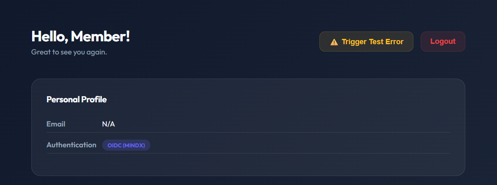
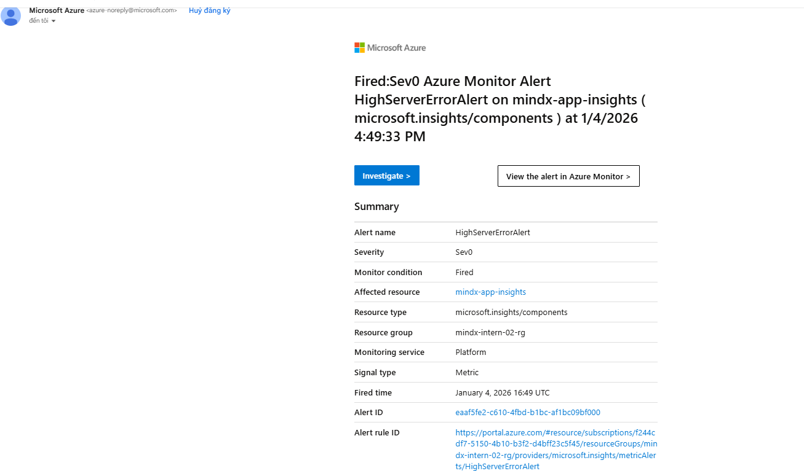
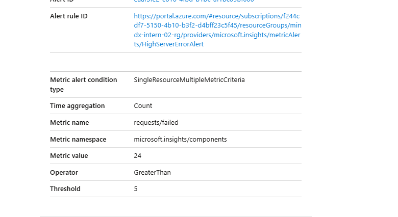

# Alerts & Verification Guide

This guide covers the creation of alert rules and the end-to-end verification process.

## 1. Creating Azure Alert Rules

### Step 1: Action Group (Notifications)
1. Go to **Monitor** -> **Alerts** -> **Action groups**.
2. Create a group (e.g., `AdminEmail`).
3. Add a notification: Type `Email`, Name `Admin`, Address `quanhaha712004@example.com`.

### Step 2: Alert Rule (Logic)
1. Go to **App Insights** -> **Alerts** -> **+ Create Alert Rule**.
2. **Condition**:
   - Signal: **Failed requests**.
   - Threshold: **Static**, Count > **5**.
   - Granularity: **5 minutes**.
3. **Actions**: Select the `AdminEmail` group.
4. **Details**: Name `HighServerErrorAlert`, Severity `1 - Critical`.

## 2. End-to-End Verification

### The Test Environment
A "Trigger Test Error" button has been added to the Dashboard to simulate real-world failure scenarios without manual shell commands.

### Verification Steps
1. **Redeploy**: Ensure version `v23` is running on AKS.
2. **Trigger**: Click the **"⚠️ Trigger Test Error"** button on the web dashboard **15 times**.

3. **Check Logs**:
   - Navigate to **Transaction Search**.
   - Confirm **Request** count is > 0 and flagged red (Success: False).
4. **Confirm Alert**:
   - Go to **Alerts** tab.
   - Status should change to **"Fired"**.
   - Check your **Email** inbox for the alert notification.
   
   

