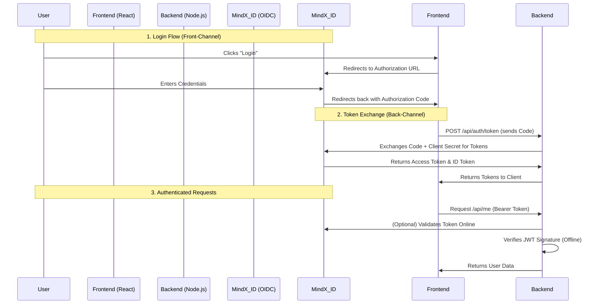

# Authentication Documentation

This document details the authentication architecture used in the project, which implements a **Hybrid OIDC Flow** with a **Backend-For-Frontend (BFF) Pattern**.

## Overview

We use **MindX ID** (an OpenID Connect Provider) to handle user identity. This approach offloads security complexities like password management and multi-factor authentication to a dedicated provider.

*   **Provider URL**: `https://id-dev.mindx.edu.vn`
*   **Protocol**: OpenID Connect (OIDC)
*   **Token Type**: JSON Web Token (JWT)

## Architecture Diagram



## Detailed Components

### 1. BFF Pattern (Backend for Frontend)

This project strictly follows the BFF pattern to enhance security.

*   **The Problem**: Single Page Applications (SPAs) like React cannot safely store "Client Secrets". If stored in the frontend code, anyone can inspect the source and steal secrets.
*   **The Solution**: We never call MindX ID's `/token` endpoint directly from React. Instead, React sends the Authorization Code to our **Node.js Backend**.
*   **Secure Exchange**: The Backend (which can safely store secrets in `.env`) adds the `CLIENT_SECRET` and performs the exchange with MindX ID.

### 2. Implementation Enpoints (`api/src/index.ts`)

The backend exposes three specific proxy endpoints to handle this flow:

#### `GET /auth/config`
*   **Purpose**: Provides the frontend with necessary OIDC configuration (ClientId, Authority URL) without exposing secrets.
*   **Logic**: Fetches discovery metadata from MindX ID and rewrites endpoints to point to our own proxy.

#### `POST /auth/token`
*   **Purpose**: Exchanges the Authorization Code for an Access Token.
*   **Security**: Injects `client_secret` from server-side environment variables before forwarding the request to MindX ID.

#### `GET /auth/me`
*   **Purpose**: Fetches the user's profile information using the Access Token.
*   **Security**: proxies the request to MindX ID's UserInfo endpoint.

### 3. Token Validation Middleware

All protected routes (e.g., `/me`) are guarded by the `validateToken` middleware, which performs a dual-check:

1.  **Offline Verification (Fast)**:
    *   Uses `jwks-rsa` to fetch MindX ID's public signing keys.
    *   Verifies the JWT signature and expiration locally.
    *   Ensures the token was issued by the correct authority.

2.  **Online Verification (Strict)**:
    *   Makes a real-time call to MindX ID's `/me` endpoint using the client secret.
    *   This ensures that even a valid JWT is rejected if the user has been banned or the session revoked on the server side.

## Configuration

Environment variables required in `api/.env`:

```env
OIDC_AUTHORITY=https://id-dev.mindx.edu.vn
OIDC_CLIENT_ID=
OIDC_CLIENT_SECRET= <-- Only known by Backend
OIDC_JWKS_URI=https://id-dev.mindx.edu.vn/jwks
```
