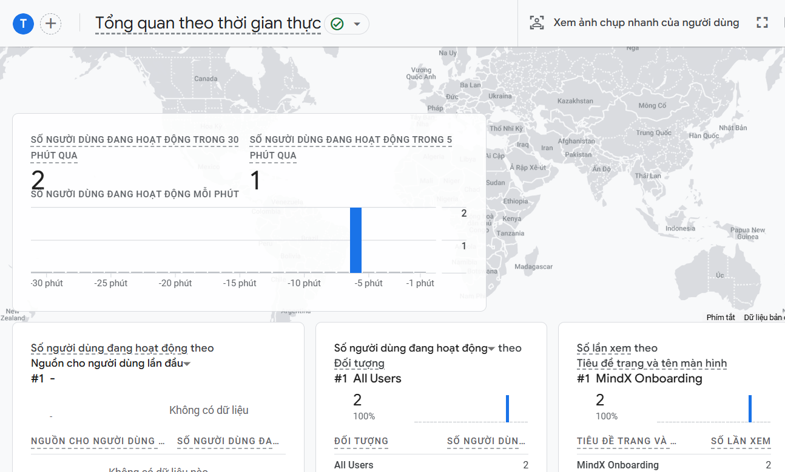

# Setup Guide: Google Analytics 4

This guide explains how to track product metrics using GA4 in the React frontend.

## 1. Frontend Integration

### Installation
```bash
cd frontend
npm install react-ga4
```

### Initialization (frontend/src/main.tsx)
Initialize GA4 at the root of the application:

```typescript
import ReactGA from "react-ga4";

const GA_MEASUREMENT_ID = "G-XXXXXXXXXX"; // Replace with your ID
ReactGA.initialize(GA_MEASUREMENT_ID);
```

## 2. Tracking Interactions

### Page Views (Dashboard.tsx)
Track page views when the component mounts:

```typescript
useEffect(() => {
    ReactGA.send({ hitType: "pageview", page: window.location.pathname });
}, []);
```

### Custom Events (Logout)
Track specific user actions like clicks:

```typescript
const handleLogout = () => {
    ReactGA.event({
        category: "User",
        action: "Logout",
        label: "Dashboard Logout Button"
    });
    // ... logout logic
};
```

## 3. Verification
- Open **Google Analytics Portal**.
- Go to **Reports** -> **Realtime**.

- Interact with the app (Navigate to Dashboard, Click Logout).
- Verify the events appear in the Realtime dashboard within minutes.
